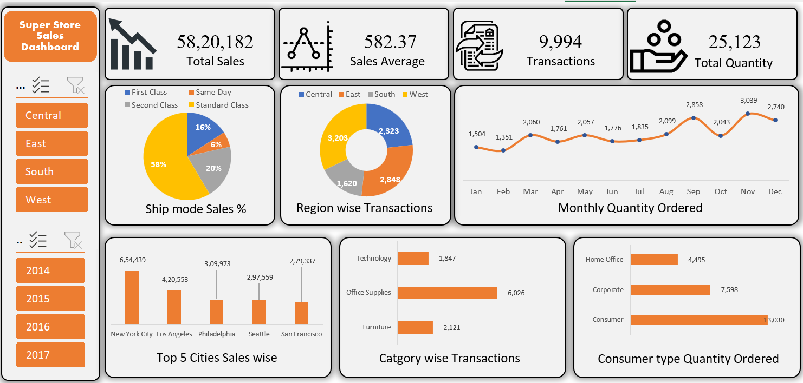

# 📊 Superstore Sales Dashboard — Excel Project

An interactive sales dashboard built in Microsoft Excel using real retail data,
featuring dynamic Pivot Tables, Charts, and Slicers for multi-dimensional analysis.

---

## 📌 Key Insights

| Metric | Value |
|---|---|
| 💰 Total Sales | ₹58,20,182 |
| 📦 Total Transactions | 9,994 |
| 📊 Sales Average | ₹582.37 |
| 🛒 Total Quantity Ordered | 25,123 |
| 🏙️ Top City by Sales | New York City (₹6,54,439) |
| 🏆 Best Category | Office Supplies (6,026 transactions) |

---

## 📊 Dashboard Preview

### 🖥️ Main Dashboard

### 📋 Pivot Report

---

## 🔍 What This Dashboard Covers

- **Ship Mode Analysis** — Standard Class leads with 58% of sales
- **Region wise Transactions** — West region highest with 3,203 orders
- **Monthly Quantity Trends** — Peak in November (3,039 units)
- **Top 5 Cities** — New York, LA, Philadelphia, Seattle, San Francisco
- **Category Breakdown** — Furniture, Office Supplies, Technology
- **Consumer Segment** — Consumer type dominates with 13,030 units

---

## 🛠️ Tools Used

- Microsoft Excel
  - Pivot Tables
  - Pivot Charts
  - Slicers (Region & Year filters)
  - Donut, Bar & Line Charts
  - Dashboard Design & Formatting

---

## 📁 Files in This Repository

| File | Description |
|---|---|
| `Superstore_Data.xlsx` | Complete Excel file with data, pivot report & dashboard |
| `dashboard.png` | Screenshot of the main dashboard |
| `Excel Pivot Table.png` | Screenshot of the pivot report sheet |

---

*Created as part of Data Analytics portfolio projects* 🚀
